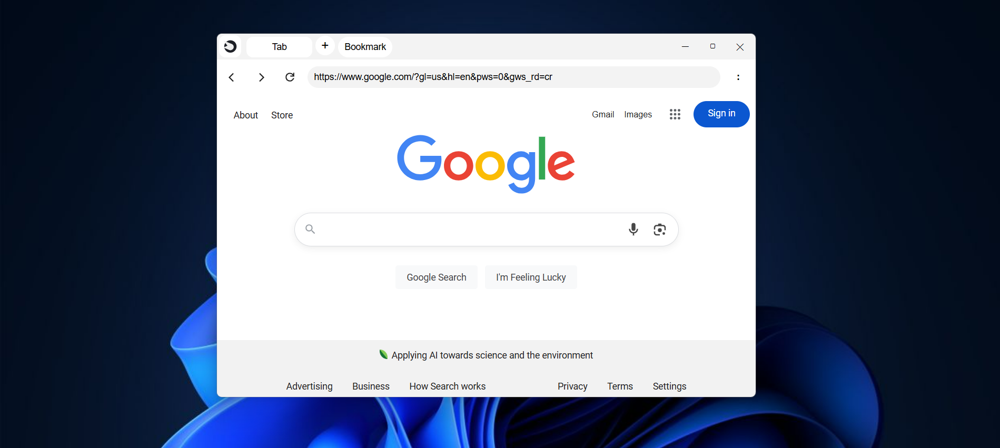

<div style=""></div>

# Fast

**Fast** is a mini browser built with **Electron.js**, featuring an integrated ad blocker and a strong focus on user privacy for a cleaner, more secure browsing experience.

## Features
- Built using **Electron.js** for fast performance
- **Integrated Adblocker** to block intrusive ads
- Simple, fast, and responsive UI

## Requirements
Before setting up **Fast Browser**, ensure you have the following installed on your local machine:
- **Node.js** (v14 or higher)
- **npm** (Node Package Manager)

## Setup and Installation

Follow the steps below to run **Fast Browser** on your local computer.

### 1. Clone the repository

First, clone the repository to your local machine using Git:

```bash
git clone https://github.com/asvistun5/Fast-Browser.git
```

2. Navigate to the project folder

```bash
cd fast-browser
```

3. Install dependencies

```bash
npm install
```

4. Run the application

```bash
npm start
```

### License

Fast Browser is open-source software licensed under the GPL License.